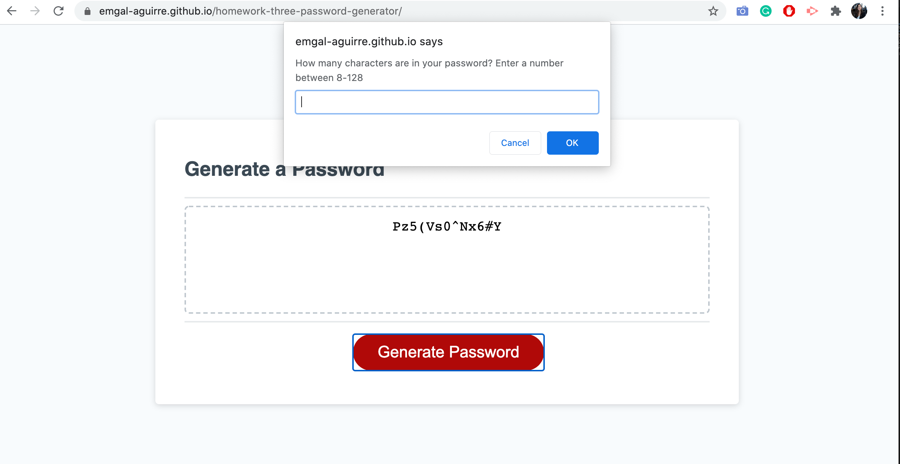
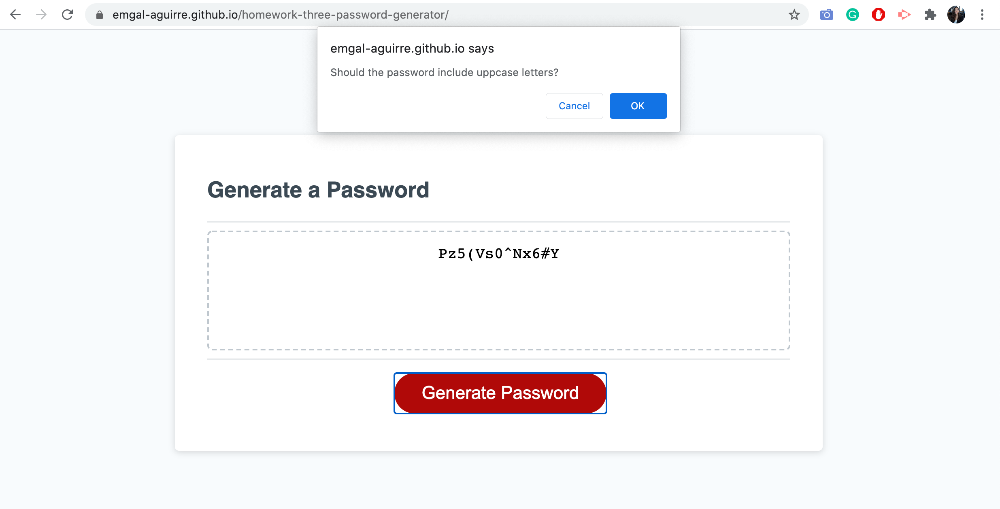
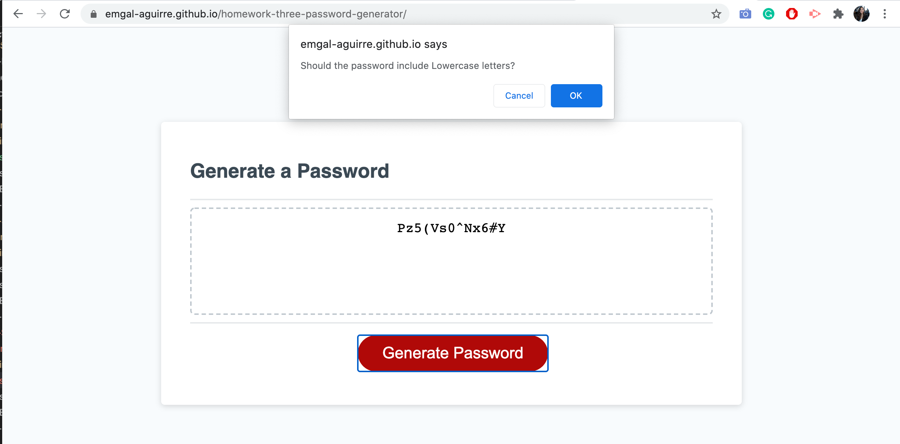
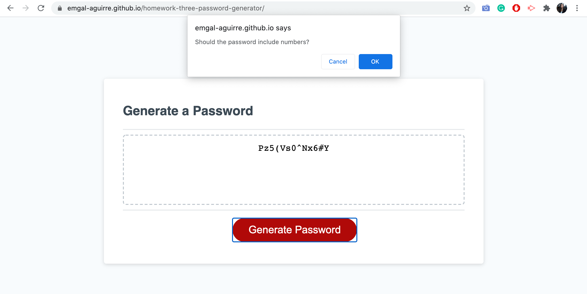
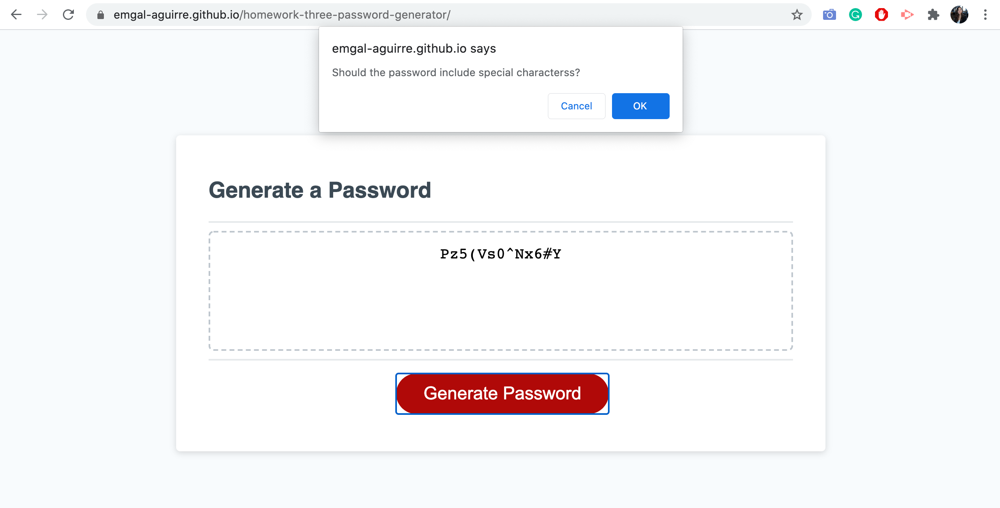
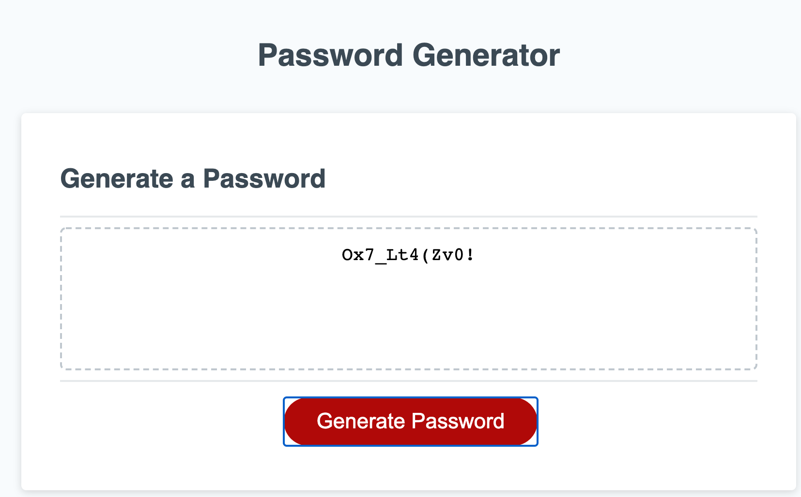

# Homework-three-password-generator
Password Generator

I created a password generator that prompts the user, uppon click, to enter a desired length of password and then the option for uppcase,
lowercase, numbers or special characters to be included in their password. After all request are submited, a randomized password is created. 

Here is a link to my live site. 
https://emgal-aguirre.github.io/homework-three-password-generator/

Here are screenshots of my website. 

1. Initial prompt.

2. Option for Uppercase,Lowercase, Number & Specail Character. 

3. Final Result.

